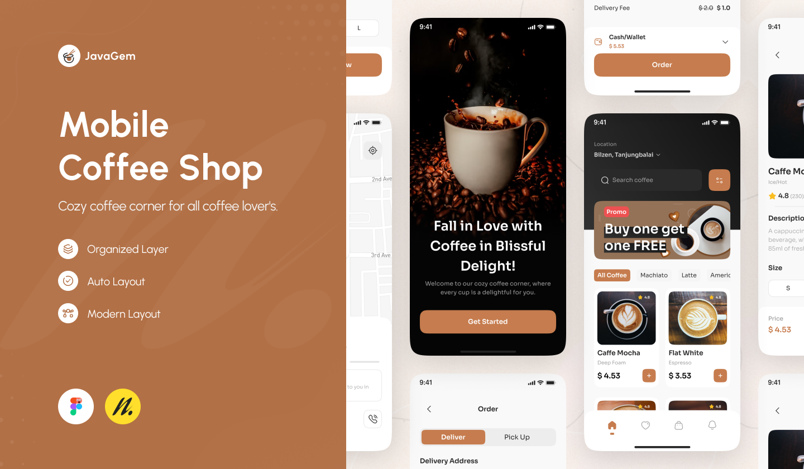

# JetCoffee


JetCoffee is a robust and modern Android application showcasing advanced development techniques and tools. This project is built with a focus on maintainability, performance, and user experience.

## Features

- **Modularization**: Organized codebase with separate modules for features, data, UI, and utilities.
- **Kotlin 2.0**: Utilizes the latest Kotlin features for concise and expressive code.
- **Jetpack Compose**: Declarative UI approach for fast and maintainable UI development.
- **Single Activity Architecture**: Streamlined navigation with composable destinations.
- **MVI (Model-View-Intent)**: Unidirectional data flow for predictable state management.
- **Hilt with KSP**: Dependency injection optimized for faster build times.
- **Shared Element Transitions**: Seamless transitions for an enhanced user experience.
- **Single Scaffold**: Consistent layout structure for a unified look and feel.
- **Dark and Light Themes**: Support for both dark and light modes.
- **Network Monitoring**: Graceful handling of connectivity changes.
- **Edge-to-Edge**: Immersive content display extending to screen edges.
- **Unit Testing**: Comprehensive unit tests with JUnit4 and MockK.
- **DataStore**: Type-safe and efficient persistent storage.

## Tech Stack

- **Language**: Kotlin 2.0
- **UI**: Jetpack Compose
- **State Management**: MVI
- **Dependency Injection**: Hilt with KSP
- **Persistent Storage**: DataStore
- **Testing**: JUnit4, MockK

## Project Setup

1. **Clone the repository**:
    ```bash
    git clone https://github.com/osamasayed585/JetCoffee.git
    cd JetCoffee
    ```

2. **Open the project**: Use Android Studio to open the project.

3. **Build the project**: Sync Gradle and build the project to download dependencies.

## Modules

- **app**: Main application module.
- **domain**: Business logic and use cases.
- **data**: Data handling and repository module.

## Status

The app is currently in progress.

## Contributing

Contributions are welcome! Please fork the repository and create a pull request with your changes.

## Special Thanks

Special thanks to [newagemood](https://www.instagram.com/newagemood/) for the free design on Figma Community.


## License

This project is licensed under the MIT License. See the [LICENSE](LICENSE) file for details.
